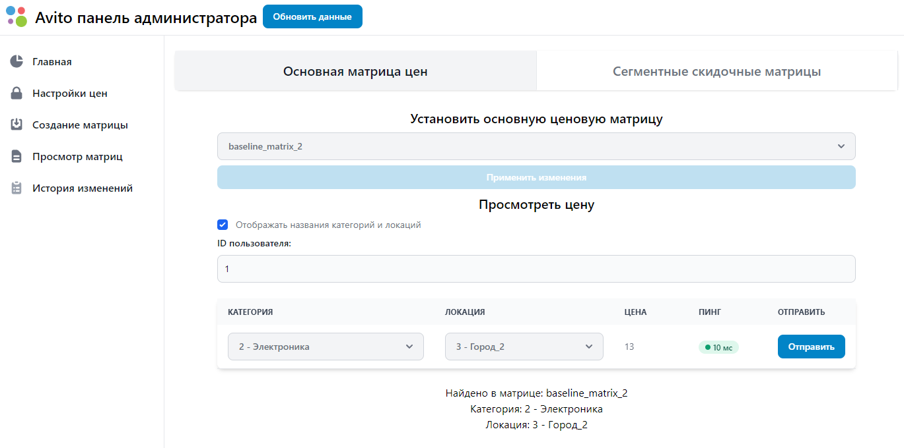
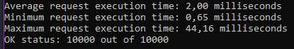

# PriceAvitoBBMM documentation (Purple Hack)
Документация к коду выполнена в виде JavaDoc и JSDoc в файлах проекта.
1. **Overall Idea and Algorithm**
2. **DevOps documentation**
	1. **Prerequisites**
	2. **Configuration Files Overview**
		1. **docker-compose.yml**
		2. **nginx.conf**
	3. **Setup Instructions**
	4. **Usage**
	5. **Troubleshooting**
	6. **Alternative**
3. **Admin UI documentation**
	1. **Introduction**
	2. **Features**
	3. **Installation**
	4. **Configuration**
	5. **API Interactions**
	6. **Usage**
4. **Java "Admin" backend API**
	1. **Description**
	2. **Features**
	3. **Optimizations**
	4. **Core libraries**
	5. **Installation**
	6. **Usage**
	7. **API Routes Documentation**
5. **Java "Price Service" backend API**
	1. **Description**
	2. **Features**
	3. **Optimizations and testing results**
	4. **Core libraries**
	5. **Installation**
	6. **Usage**
	7. **API Routes Documentation**
6. **Database**
	1. **Overview** 
	2. **Schema**
		1. **Schema example**
		2. **Baseline matrices and discount matrices content**
		3. **Baseline matricies and discount matrices indexer**
    4. **History**
	3. **Driver**
    
# Overall Idea and Algorithm

**DISCLAIMER!** Demo server is available, but due to insufficient resources can behave unexpectedly. Local docker statup is prefferable. Demo server: [http://purple.alephdev.ru/](http://purple.alephdev.ru/)

The idea is to create an independent Price Service API that accesses its own database, which is a replica or partial replica by region from the main database for storing matrices. In case of unavailability of the database, lack of necessary geo-data in the matrix, or service disconnection as a whole, the load balancer instantly redirects the request to another Price Service API, ensuring continuous price delivery.

The absence of delay in price updates is guaranteed by a constant connection between the Price Service API and the main Admin API, which is used to create new matrices/edit matrices and set them on the Price Service API. When a new matrix is loaded, the necessary data from it is cloned into the database replicas, and until the cloning into available replicas is completed and Price Service APIs confirm the information that their matrices are complete for proper price request handling, setting a partially loaded matrix is prohibited. Thus, changing the baseline matrix or segments is allowed only when all price delivery services can start working with the new matrix, and **price consistency during local launch is guaranteed**, during production launch - depends only on the speed of data center connection and ping between them. (Example: [**"New matrix applying diagram"**](#new-matrix-applying-diagram))

Load testing results with key disadvantages and scaling methods are provided in the [**"Java "Price Service" backend API" - "Optimizations and testing results"**](#optimizations-and-testing-results) section.

UI/UX description and screenshots are provided in the [**"Admin UI documentation" - "Usage"**](#admin-ui-documentation) section, also there are described scenarios of working with the system.

Persistence of price storage is ensured by the formed Docker configuration, in case of unexpected shutdown, containers are automatically restarted.

Monitoring and logging are provided by Docker with all logs saved to file. Additionally, the history of changes of the selected baseline matrix and discount matrices is implemented separately (more details - [**"Admin UI documentation" - "Features"**](#admin-ui-documentation), [**"Admin UI documentation" - "API Interactions"**](#api-interactions) and [**"Java "Admin" backend API" - "Features"**](#java-admin-backend-api)). Also, the Admin API itself monitors all price delivery services for their availability, and all price delivery services monitor each other's status, **redirecting requests if necessary**.

### Matrix Creation Algorithm
1. Create a new empty matrix or a copy of the provided parent matrix.
2. Changed/added rows of the matrix are written to the created matrix, when null is set - the price is reset and will be taken from the parent category/location upon price request. \*
3. If hashing is enabled, then a hash table is generated. \*
4. If caching is enabled, before transitioning the matrix to the "ready" state, the results of sending `/price` requests for all matrix rows are calculated using an optimized algorithm. \*
5. The matrix name is set, if the matrix is a descendant of baseline - it is recorded in the baseline category, if it is a descendant of discount, or a new matrix - in the discount category.
6. Replicas and partial regional replicas of matrices are sent to the replication databases of services.
7. After full loading of replicas to all currently available databases, the matrix is marked as ready for installation on all Price Service APIs.

\* more details - in [**"Java "Admin" backend API" - "Features"**](#java-admin-backend-api) and [**"Java "Admin" backend API" - "Optimizations"**](#optimizations)

### Price Search Algorithm
1. Request redirection in case of problems with connecting to the database or absence of the specified region in the database copy.
2. Getting the names of discount matrices from the segments of the specified user.
3. For each discount matrix:
    - Getting the price from the cache when caching is used. \*\*
    - Optimized traversal through categories and locations. Maximum number of traversal iterations for 9 nested categories and 3 nested locations = 27 requests, **searching for the parent category id happens in O(1)** on average, due to the use of hash tables. \*\*
        - For obtained category and location values, a hash is calculated, based on which a search is performed in the matrix, **average query time O(1)**. \*\*
    - If the price was found at any stage, the algorithm stops and returns the price to the end user.
4. If discount matrices are missing or search in them fails, the described algorithm continues for the baseline matrix.

Total number of iterations: O(1) when searching in one matrix. Maximum: O(n), where n - number of matrices in case if `n - 1` discount matrices are empty. Load testing results are provided in the [**"Java "Price Service" backend API" - "Optimizations and testing results"**](#optimizations-and-testing-results) section.

\*\* more details - in [**"Java "Price Service" backend API" - "Features"**](#java-price-service-backend-api) and [**"Java "Price Service" backend API" - "Optimizations"**](#java-price-service-backend-api)

## *Перевод*:

Идея заключается в создании независимого Price Service API, который обращается к своей собственной базе данных, являющейся репликой или частичной репликой по региону от основной базы данных для хранения матриц. При недоступности базы данных, отсутствии необходимых гео-данных в матрице, или отключении сервиса в целом, load-balancer мгновенно перенаправляет запрос на другой Price Service API, что обеспечивает постоянную отправку цен.

Отсутствие задержки в обновлении цен гарантируется постоянным подключением между Price Service API и основным Admin API, которое используется для создания новых матриц/редактирования матриц и их установки на Price Service API. Когда загружена новая матрица, необходимые данные из нее клонируются в реплики баз данных, и пока клонирование в доступные реплики не завершено и Price Service APIs не подтверждают информацию о том, что их матрицы являются полными для корректной обработки запросов цен, установка неполностью загруженной матрицы запрещается. Таким образом, смена baseline матрицы или segments разрешается только в те моменты, когда все сервисы отдачи цен могут начать работу с новой матрицей, и **согласованность цен при локальном запуске гарантированна**, при запуске в production - зависит только от скорости соединения дата-центров и пинга между ними.

Результаты нагрузочного тестирования предоставлены в разделе **"Java "Price Service" backend API" - "Optimizations and testing results"**.

Описание UI/UX и скриншоты предоставлены в разделе **"Admin UI documentation" - "Usage"**, так же там описаны сценарии работы с системой.

Персистетность хранения цен обеспечивается сформированной конфигурацией Docker, в случае непредвиденного падения, контейнеры автоматически перезапускаются.

Мониторинг и сбор логов обеспечивает Docker с сохранением всех логов в файл. Отдельно реализована история изменения выбранной основной матрицы и скидочных матриц (подробнее - **"Admin UI documentation" - "Features"**, **"Admin UI documentation" - "API Interactions"** и **"Java "Admin" backend API" - "Features"**). Так же, сам Admin API мониторит все сервисы отдачи цен на предмет их доступности, и все сервисы отдачи цен мониторят состояние друг друга, **перенаправляя запросы при необходимости**.

### Алгоритм создания матрицы
1. Создается новая пустая матрица либо копия предоставленной родительской матрицы.
2. Измененные/добавленные строки матрицы записываются в созданную матрицу, при установке null - цена сбрасывается, и будет взята из родительской категории/локации при запросе цены.*
3. Если хэширование включено, то проводится генерация хэш-таблицы.*
4. Если кэширование включено, то перед переходом матрицы в "готовое" состояние, вычисляются результаты отправки запросов `/price` для всех строк матрицы по оптимизированному алгоритму.*
5. Устанавливается название матрицы, если матрица является потомком baseline - она записывается в категорию baseline, если она является потомком discount, либо новой матрицы - в категорию discount.
6. Реплики и частичные региональные реплики матриц отправляются в репликационные базы данных сервисов.
7. После полной загрузки реплик на все доступные на данный момент базы данных, матрица помечается как готовая к установке на всех Price Service APIs.

* подробнее - в **"Java "Admin" backend API" - "Features"** и **"Java "Admin" backend API" - "Optimizations"**

### Алгоритм поиска цен
1. Перенаправление запроса при наличии проблем с подключением к базе данных или отсутствии указанного региона в копии базы данных.
2. Получение наименований скидочных матриц из сегментов указанного пользователя.
3. Для каждой скидочной матрицы
	- Получение цены из кеша при использовании кеширования.**
	- Оптимизированный обход по категориям и локациям. Максимальное число итераций обхода для 9 вложенных категорий и 3 вложенных локаций = 27 запросов, **поиск id родительской категории происходит за O(1)** в среднем, за счет использования хеш-таблиц**
		- Для полученных значений категории и локации вычисляется хеш, по которому происходит поиск в матрице, **среднее время запроса O(1)** **
	- Если на каком-то из этапов цена была найдена, алгоритм останавливает работу и цена возвращается конечному пользователю.
4. В случае, если скидочные матрицы отсутствуют или поиск в них не удался, описанный алгоритм продовится для baseline матрицы.

Итоговое число итераций: O(1) при поиске в одной матрице. Максимум: O(n), где n - число матриц в случае, если `n - 1` скидочных матриц пусты. Результаты нагрузочного тестирования предоставлены в разделе **"Java "Price Service" backend API" - "Optimizations and testing results"**.

** подробнее - в **"Java "Price Service" backend API" - "Features"** и **"Java "Price Service" backend API" - "Optimizations"**

### New matrix applying diagram
- Example 1: If only 2 out of 3 databases are ready, the matrix is forbidden to be ready for installation.
    
- Example 2: The check for availability of 1 out of 2 databases and services is performed.
    
- Example 3: All databases and services are ready, sending status OK. The matrix is marked as ready and being changed instantly with small POST request to all services to update the matrix index.
    

# DevOps documentation

## Prerequisites
- Docker (or compatible container runtime) installed
- Access to the Docker configuration files
- Access to the server firewall service
- *Optional* Git installed

## Configuration Files Overview
### docker-compose.yml
- **Namespace Creation**: Defines the cluster.
- **Services**: Configures 8 services by default (`postgres-primary`, `postgres-replica-1`, `postgres-replica-2`, `avito-admin-api`, `avito-prices-api-primary`, `avito-prices-api-replica-1`, `avito-prices-api-replica-2`, `nginx`) and exposes ports for different services within the cluster, allowing direct access via specified node ports.
- **Bridge network configuration**: Configures the inner bridge network for the cluster with IP `172.19.0.1` and 16 addresses.
- **Custom services configuration**: Amount of services for database replicas and prices replicas can be adjusted if needed.

### nginx.conf
- **Namespace Creation**: Defines the nginx routing configuration. Located in `frontend/nginx`.
- **Upstream servers**: Configures 3 upstreams for price services (`172.19.0.1:8081`, `172.19.0.1:8082`, `172.19.0.1:8083` - `avito-prices-api-primary`, `avito-prices-api-replica-1`, and `avito-prices-api-replica-2` respectively). Must be adjusted if amount of replicas or their IP adresses is changed, replicas may not be in the same docker compose network.
- **Client max body size**: Configures max body size for the file uploads in 3GB by default. Can be adjusted if uploaded matrices are larger in size than expected.
- **Rerouting to /api and /price**: Configures rerouting to Admin Backend API and upstream price services.


## Setup Instructions
1. **Clone repository**: Via git command
   ```shell
   git clone https://github.com/TheMixaDev/PurpleAvito.git
   ```
2. **Start compose**:
	1. **Startup with default configuration**
		1. **Start services**: Via single `.sh` file. Please do not skip sleep's in the script to ensure the cluster being initialized correctly.
			```shell
			./start.sh
			```
	2. **Start with custom changed replicas configuration**
		1. **Adjust `start.sh` file**: Include or remove docker containers replicas services and databases in the file for proper startup and first compose initialization.
		2. **Start services**: Via edited `.sh` file. Please do not skip sleep's in the script to ensure the cluster being initialized correctly.
			```shell
			./start.sh
			```
	3. **Start with Kubernetes**
		1. **Start Minikube**: Ensure Minikube is running and set to use the correct Kubernetes context.
			```shell
			minikube start
			```
		2. **Deploy Configurations**: Apply your YAML configurations to your cluster.
			```shell
			kubectl apply -f lb.yaml
			kubectl apply -f config.yaml
			```
		3. **Expose Services Locally**: Use Minikube's tunnel feature to expose the LoadBalancer service on your localhost.
			```shell
			minikube tunnel
			```
3. **Setup firewall**: On production server, open ports 80 and 443 in the firewall, configure SSL configuration in nginx if needed.

## Usage
Once the services are exposed, you can access the Admin UI and Price Service via the localhost:
 - **Admin UI**: [http://localhost](http://localhost)
 - **Price Service under load balancer**: [http://localhost/price](http://localhost/price)
 - **Raw access to Price Service #1**: [http://localhost:8081/price](http://localhost:8081/price)
 - **Raw access to Price Service #2**: [http://localhost:8082/price](http://localhost:8082/price)
 - **Raw access to Price Service #3**: [http://localhost:8083/price](http://localhost:8083/price)
 - **Swagger documentation for Admin UI**: [http://localhost:8080/swagger-ui/index.html#](http://localhost:8080/swagger-ui/index.html#)
 - **Swagger documentation for Price Service**: [http://localhost:8081/swagger-ui/index.html#](http://localhost:8081/swagger-ui/index.html#)

## Troubleshooting
- **Service Unavailable, Bad Gateway**: Ensure nginx tunnel is running and check for any error messages in the service's events and all of the ports are correctly forwarded
- **IP Conflicts**: Ensure that Docker compose has enough addresses for all services in `docker-compose.yml`. Increase the number of addresses in `docker-compose.yml` if amount of services exceeds the number of addresses.
- **Failed first initialization of any container**: Initialization might fail if Admin Backend API will not have enough time on startup to initialize primary database before restarting.
	- *fix*: Increase sleep times in `start.sh` file.
	- *alternative fix*: Restart docker compose.
  - *alternative fix*: Start `postgres-primary` container, after that start `avito-admin-api` container. After successfull initialization message in console, stop containers and run `start.sh` file again.
- **Матрица после добавления не появилась в списке матриц**: Это означает, что добавленная матрица еще не склонировалась на реплики, и потому не может быть доступна для использования. Если это продолжается длительное время, то может потребоваться перезапуск контейнеров, либо повторная загрузка изменений матрицы.

## Alternative

You can use `Kubernetes cluster managed by Minikube` to deploy the whole project with ready-to-use load-balancer and clustorization. Also, you can use `cockroachdb` as a database with built in load-balancer.

# Admin UI documentation

## Introduction

PriceAvitoBBMM is a comprehensive application designed to streamline the management of pricing services. Whether you're a business owner, service provider, or just someone interested in tracking and analyzing price matrices, PriceAvitoBBMM offers a range of features to meet your needs.

## Features

-   **Price Services on Map:** Visualize available price services on an interactive map, providing a real-time overview of their current status and response time.
-   **Baseline Price Matrix:** Easily set up a baseline price matrix to establish a foundation for your pricing structure.
-   **Discount Price Matrices:** Fine-tune your pricing strategy by creating segmented discount price matrices, allowing for more targeted and customized pricing.
-   **Price by Request:** Quickly check prices on demand with the "Price by Request" feature, providing instant access to current pricing information.
-   **Create New Matrix:** Generate a new pricing matrix effortlessly by inputting the desired data and parameters or by inputing a file.
-   **Clone Matrix:** Duplicate existing matrices and modify data to experiment with different pricing scenarios without affecting the original matrix.
-   **Get Matrix Rows:** Access all rows of your matrices to view detailed information and make informed decisions.
-   **History Access:** Explore the history of changes made to selected price matrices, ensuring transparency and accountability in pricing adjustments.

PriceAvitoBBMM is the go-to app for anyone seeking a powerful, user-friendly tool to manage, visualize, and optimize pricing structures. Streamline your pricing strategy and stay ahead in the competitive landscape with PriceAvitoBBMM.

## Installation

1.  Clone the repository to your local machine.
2.  Install the required dependencies as listed in the `frontend/package.json` file.
3.  Run `npm run build` for creating compiled artefacts or `npm run dev` for starting the Admin UI in debug mode.

##  API Interactions

The Admin UI interacts with a Admin Backend API to perform a range of operations, as highlighted in the `services` directory:

-   **HistoryService:**
    -   **Retrieve Matrix History:** Fetch the history of changes made to selected matrices, providing a detailed log of adjustments over time.

-   **MatrixService:**
    -   **Setup All Matrices:** Utilize MatrixService to set up and configure all pricing matrices, ensuring a seamless integration into the PriceAvitoBBMM system.
    -   **File Upload as Matrix:** Upload matrix by .csv file, directly as part of the matrix setup process.

-   **PriceServersService:**
    -   **Fetch Price Information:** Retrieve information from Price Servers, ensuring real-time data synchronization and accuracy in pricing information.
    -   **Monitor Price Server Status:** Check the status and responsiveness of Price Servers to maintain optimal performance and reliability.

-   **TreeService:**
    -   **Get Categories Tree:** Access category trees to organize and categorize pricing services, providing a structured view for users and enhancing navigation.
    -   **Retrieve Locations Tree:** Fetch location trees to streamline the organization of pricing services based on geographic regions, facilitating efficient service mapping.

## Usage

-   For development mode, start the Admin UI via `npm run dev`.
-   For production mode, deploy `dist` of `npm run build` to your production server.

Use Cases:
- Checking current status of servers with interactive map, ping and server names. [http://localhost/](http://localhost/)

- UI for setting up current matrix, after matrix selection and clicking "Apply" button. User will be prompted with confirmation. If not all price services have new matrix settings, the error message will be shown with amount of ready-to-use price services. Also, user can check on this page current price for user_id, category and location. [http://localhost/setup](http://localhost/setup)

- UI for setting up discount matrices and their segments. Using "Apply all" button is recommended to avoid conflicts on setting matrices one by one. [http://localhost/setup](http://localhost/setup) (button "Segment discount matrices" is on top)

- UI for creating a new matrix with parent matrix selector. "Drop matrix" button removes parent (for creating new clear matrix). "Set primary" button sets current baseline matrix. Invalid rows are highlighted with red. UI accepts files in `.json`, `.csv` and `.sql` format with data. [http://localhost/create](http://localhost/create)

- UI for matrix observer. After selection of matrix, it will be shown in the UI. "Edit" button will redirect user to matrix editor with selected row. [http://localhost/matrix](http://localhost/matrix)

- UI for matrices change history. "Watch" button redirects user to matrix observer. [http://localhost/history](http://localhost/history)

# Java "Admin" backend API

### Description

The Admin Backend API is a robust Java Spring Boot application that serves as the backbone for managing and optimizing various aspects of the pricing system. Built using JDBC to interact with the database, this API provides a comprehensive set of functionalities to streamline administrative tasks.

### Features

-   **Initialize Database:** Seamlessly set up the database using provided starter scripts, ensuring a smooth and error-free initialization process.
-   **Store Locations and Categories Trees:** Efficiently manage and organize locations and categories trees to enhance the organization of pricing data.
-   **Store Users Discount Segments Information:** Maintain and store users' discount segments information for personalized and targeted pricing strategies.
-   **Check Availability of "Price Services":** Verify the availability of "Price Services" and send them selected baseline matrix and segment matrices for efficient pricing updates.
-   **Check Readiness of "Price Services":** Ensure the readiness of "Price Services" to apply new matrix settings, minimizing downtime during updates.
-   **Store and Provide History of Matrix Changes:** Keep a detailed history of matrix changes for transparency and accountability in pricing adjustments.
-   **Send Current Matrix Settings:** Provide clients with real-time information on the current settings of matrices, enabling accurate decision-making.
-   **Receive New Matrix Data in CSV File:** Effortlessly receive new matrix data in CSV format, creating matrices based on parent matrices or generating entirely new matrices.
-   **Optimize Matrix Data for Search Purposes:** Enhance search performance by optimizing matrix data through hashing and caching, ensuring faster and more efficient search operations.


### Optimizations

- **Asynchronous Request Sending to Price Services API:** Implementing asynchronous request sending to the Price Services API improves overall system responsiveness and performance by allowing multiple requests to be processed concurrently without blocking the main thread.
- **Chunked Formation of SQL Script for Adding/Updating Rows in the Database:** By chunking the formation of SQL scripts for adding or updating rows in the database, the system optimizes resource utilization and reduces the overhead associated with processing large datasets, resulting in faster execution and improved application performance.
- **Utilization of Buffered Reading When Loading Files:** Leveraging buffered reading during file loading minimizes I/O overhead by efficiently managing read operations and reducing the usage of memory, resulting in faster file processing and improved overall performance.
- **Initialization of Matrix Cloning via Database:** Initializing matrix cloning through database copying instead of separate queries enhances copying speed by minimizing network latency and database overhead, thereby improving the overall speed of the cloning process.
- **Hash for matrix data:** Efficiently hash matrix data by location and category to improve search performance. Initial index used in hashing process calculated by formula: `locationId + maxLocationId * (categoryId - 1)`. The size of hash table varies from database settings (and database itself) and hash-function. For 160 million rows tables recommended setting requires function producing large-sized hash-table. Using of hashes provides average and best case perfomance of **O(1) complexity**.
- **Auto caching for created matrices:** Automatically cache created matrices search results to improve performance by calculating all resulting price values for each entry in the table using algorithm from "Price Service API" (described in the ["Overall Idea and Algorithm"](#overall-idea-and-algorithm)) but with checking only one parent node for each row. Caching is enabled by default for all new price matrices. Provides **O(1) complexity** for searching (only one entry for each price matrix being checked on `/price` request).

**WARNING!** Enabling caching **drastically increases** matrix upload time.

### Core libraries

- org.springframework.boot
- org.projectlombok
- org.apache.commons
- org.springdoc

### Installation
- **Prerequisites:**
  - Ensure you have Java installed on your system. You can download it from the official Java website.
  - Make sure Maven is installed on your machine. You can download it from the official Apache Maven website.

- **Clone Repository:** Clone the repository containing the Java Spring Boot application to your local machine.

- **Navigate to Project Directory:** Change your current working directory to the project directory.

- **Install Dependencies:** Run the Maven command to install the required dependencies for the project.
    ```bash
    mvn install
    ```

- **Build the Project:** Build the project using Maven.
    ```bash
    mvn clean package
    ```
- **Setup environment variables:**
  - **SPRING_DATASOURCE_URL:** The URL/IP of the database.
  - **SPRING_DATASOURCE_USERNAME:** The username to access the database.
  - **SPRING_DATASOURCE_PASSWORD:** The password to access the database.
  - **AVITO_PRICES_SERVICES_URLS**: The URLs/IPs of the price services.
  - **AVITO_PRICES_SERVICES_NAMES**: The names of the price services for display in the Admin UI.
  - **AVITO_PRICES_SERVICES_COORDS**: The coordinates of the price services for display on map in the Admin UI.
  - **DEMO_SERVER**: Marks the server as a demo server. Limits max changed rows in one matrix to 300,000.
  - **AVITO_PRICES_API_STATUS_TIMEOUT**: The timeout in seconds for the API status check. Increase if servers are very far away apart from each other.
  - **AUTO_CACHE**: Enable or disable auto caching of the `/price` results for new matrices.
  - **USE_HASH**: Using of hash for searching while filling matrix data cache.

### Usage

*Disclaimer:* This chapter is for starting service without Docker. We recommend using Docker for testing purposes.

To run the Java Spring Boot application, follow these steps:

- **Navigate to Project Directory:** Change your current working directory to the project directory.
    ```bash
    cd <project_directory>
    ```

- **Run the Application:** Execute the generated JAR file to run the Spring Boot application.
    ```bash
    java -jar target/avito-admin-api-0.0.1.jar
    ```

### API Routes Documentation

Backend Admin API Routes documentation can be accessed with swagger after server startup via URL [http://localhost:8080/swagger-ui/index.html#/](http://localhost:8080/swagger-ui/index.html#/) or on demo server [DEMO URL HERE](DEMO URL HERE)

# Java "Price Service" backend API

### Description

The Price Service API, crafted with Java Spring Boot and utilizing JDBC for database access, is a dynamic component that plays a pivotal role in efficiently managing and delivering pricing information. With a range of features designed for optimal performance, this API ensures accurate and timely pricing responses.

### Features

-   **Find Price with Optimal Algorithm:** Employ an intelligent algorithm to find the corresonding price, maximizing efficiency in determining the most relevant pricing information.
-   **Check Availability of Matrices in Database:** Verify the availability of matrices in the database, ensuring real-time access to the latest pricing data.
-   **Set New Matrix if in Database:** Dynamically update matrices if they are present in the database, facilitating seamless integration of new pricing information.
-   **Monitor Server Status:** Continuously monitor server status and report unavailability, ensuring proactive measures can be taken in case of potential issues.
-   **Store Region-based Parts of Matrices:** Optimize storage by selectively storing region-based parts of matrices, reducing data redundancy and enhancing retrieval efficiency.
-   **Attempt to Get Price from Another Price Service:** In the event of unavailability or when the required price is not in the region-based database, attempt to retrieve the price from another Price Service, ensuring continuity of service.
-   **Cloneable:** Clone the Price Service API an unlimited number of times to create independent instances, allowing for scalable and parallel pricing services tailored to specific needs.

### Optimizations and testing results

- **Hash search:** Using of efficiently hashed matrix data by location and category done by Admin API. Hash is being calculated from initial index `locationId + maxLocationId * (categoryId - 1)`. Using of hashes provides average and best case perfomance of **O(1) complexity**.
- **Precalculated cached values:** If caching was enabled for matrix where is search being performed service uses precalculated value from database. Provides **O(1) complexity** for searching (only one entry for each price matrix being checked on `/price` request).
- **RAM storing**: Storing the category and location trees in memory with a fast search method, allowing for quick access and retrieval of information from the tree structure. Also user segments are stored in memory.

Test Machine Configuration:
- Processor: **12th Gen Intel(R) Core(TM) i7-12700K 3.60GHz**
  - Cores: **12**
  - Threads: **20**
- RAM: **32GB DDR4**
- Storage: **500GB SSD**
- Operating system: **Windows 10 Pro**

Services configuration:
- Amount of price services: **3**
- Load-balancer enabled: **Yes**
- Use Hash-table: **Yes**
- Use Caching: **No**
- Running Locally: **Yes** (excluded intenet ping and network latency)

`/price` query request:
- Microcategory ID: **Random**
- Location ID: **Random**
- User ID: **2900** (5 empty discount matrices to check before passing into baseline matrix, in which only value for `location_id = 1` and `microcategory_id = 1` is set)

2 threads sending 100k requests, 200k requests total

Testing program written in `C#`

#### Test results

1. Thread 1:
	- **100%** of requests succeeded
	- Min execution time: **0.53ms**
	- Max execution time: **45.61ms**
	- Average execution time: **1.77ms**
		
2. Thread 2:
	- **100%** of requests succeeded
	- Min execution time: **0.65ms**
	- Max execution time: **44.16ms**
	- Average execution time: **2.00ms**
		

#### Key disadvantages of the system

- **Not optimized cache creation on matrix cloning:** Cache create with new matrix is not fully optimized when matrix "clone with edit" is performed. In current version, after applying differences to matrix, it's cache is being fully recreated, increasing the matrix upload time significantly.
- **Spring servlets takes time to initialize:** Because of JVM, lazy initialization of Spring servlets takes time, resulting in slower response time for first request.
- **Storage space**: Hashing and caching (especially for large 160 million matrixes) takes up a lot of disk space.

#### Scaling methods

- **Increasing the number of price services:** Price Service APIs work as independent components, which can be scaled up and down.
- **Using Kubernetes:** The application can be scaled up and down using Kubernetes with autoscaling.
- **Increasing server resources:** Upgrade the hardware resources (CPU, RAM, disk space) of existing servers running Price Service APIs to handle increased loads.
- **Advanced caching:** Implement caching mechanisms such as Redis or Memcached to store frequently accessed data in memory, reducing the load on the database and improving response times.

### Core libraries

- org.springframework.boot
- org.projectlombok
- org.apache.commons
- org.springdoc

### Installation

- **Prerequisites:**
  - Ensure you have Java installed on your system. You can download it from the official Java website.
  - Make sure Maven is installed on your machine. You can download it from the official Apache Maven website.
- **Clone Repository:** Clone the repository containing the Java Spring Boot application to your local machine.

- **Navigate to Project Directory:** Change your current working directory to the project directory.

- **Install Dependencies:** Run the Maven command to install the required dependencies for the project.
    ```bash
    mvn install
    ```

- **Build the Project:** Build the project using Maven.
    ```bash
    mvn clean package
    ```
- **Setup environment variables:**
  - **JAVA_TOOL_OPTIONS:** Used for setting port of price service e.g. `-Dserver.port=8081`
  - **AVITO_ADMIN_API_URL**: The URL/IP of the Admin API.
  - **MAX_DATABASE_PING_IN_MILLIS**: The maximum time in milliseconds to wait for database connection. Should be low, because architecture is built upon the principle that database and service are in one datacenter.
  - **SPRING_DATASOURCE_URL:** The URL/IP of the database.
  - **SPRING_DATASOURCE_USERNAME:** The username to access the database.
  - **SPRING_DATASOURCE_PASSWORD:** The password to access the database.
  - **SELF_URL**: The URL/IP of the server for exclude health check of server by itself.
  - **AVITO_PRICES_SERVICES_URLS**: The URLs/IPs of the price services. Used for getting their region-based location, performing healthchecks and redirecting requests if necessary.
  - **LOCATION**: Region-based location of the server.
  - **USE_HASH**: Using of hash for searching on `/price` request.

### Usage

*Disclaimer:* This chapter is for starting service without Docker. We recommend using Docker for testing purposes.

To run the Java Spring Boot application, follow these steps:

- **Navigate to Project Directory:** Change your current working directory to the project directory.
    ```bash
    cd <project_directory>
    ```

- **Run the Application:** Execute the generated JAR file to run the Spring Boot application.
    ```bash
    java -jar target/avito-prices-api-0.0.1.jar
    ```


### API Routes Documentation

Backend Price Service API Routes documentation can be accessed with swagger after server startup via URL [http://localhost:8081/swagger-ui/index.html#/](http://localhost:8081/swagger-ui/index.html#/) or on demo server [DEMO URL HERE](DEMO URL HERE) all price APIs under all ports has their own swagger.

# Database

## Overview 
We use Postgresql as main database and for replicas database. 
You can use either it or any other Postgresql compatible, like cockroach for extended features with load-balancing and data managment.

## Schema 
You can see its schema after database initialization by Admin API Backend, via accessing to container and inspecting it using `psql -d avito_db -U hulumulu`. Current selected baseline matrix and user segments are stored in `.json` file on Admin API and all Price Services API.

### Schema example

| Schema | Name               | Type  |  Owner   |
|--------|--------------------|-------|----------|
| public | baseline_matrix_1  | table | hulumulu |
| public | baseline_matrix_2  | table | hulumulu |
| public | baseline_matrix_3  | table | hulumulu |
| public | discount_baseline  | table | hulumulu |
| public | discount_matrix_1  | table | hulumulu |
| public | discount_matrix_2  | table | hulumulu |
| public | discount_matrix_3  | table | hulumulu |
| public | history            | table | hulumulu |
| public | source_baseline    | table | hulumulu |

### Baseline matrices and discount matrices content

| Column                 |  Type   | Collation | Nullable | Default |
|------------------------|---------|-----------|----------|---------|
| id                     | bigint  |           |          |         |
| microcategory_id       | integer |           | not null |         |
| location_id            | integer |           | not null |         |
| price                  | integer |           |          |         |
| found_price            | integer |           |          |         |
| found_microcategory_id | integer |           |          |         |
| found_location_id      | integer |           |          |         |

### Baseline matricies and discount matrices indexer

| Column    |          Type          | Collation | Nullable |                    Default                    |
|-----------|------------------------|-----------|----------|-----------------------------------------------|
| id        | bigint                 |           | not null | nextval(sequence) |
| is_cached | boolean                |           |          | false                                         |
| name      | character varying(255) |           |          |                                               |
| ready     | boolean                |           |          |                                               |

### History

| Column     |          Type          | Collation | Nullable |               Default               |
|------------|------------------------|-----------|----------|-------------------------------------|
| id         | bigint                 |           | not null | nextval('history_id_seq')           |
| name       | character varying(255) |           |          |                                     |
| segment_id | bigint                 |           |          |                                     |
| timestamp  | bigint                 |           |          |                                     |

## Driver
We use raw SQL and JDBC driver for executing statements
